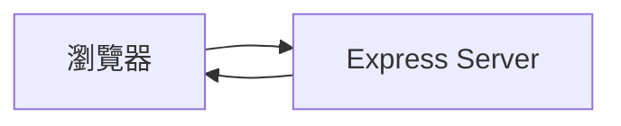
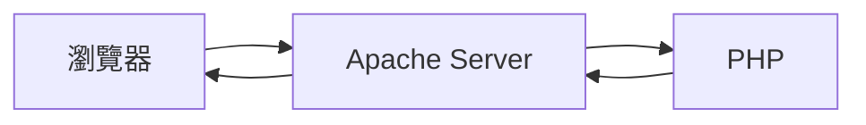
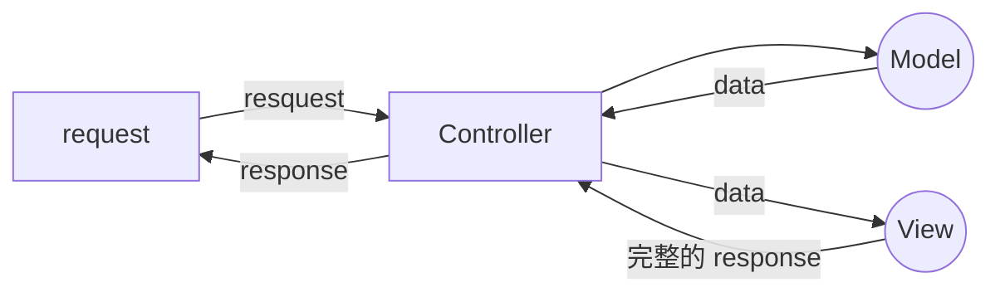

###### tags: `後端`

## Express

## Apache + PHP

需要透過中間的 Apache Server，會受到檔案路徑的限制（可修改）

## MVC

## Express 基本架構
### 實作 view
安裝 template engines
```
npm install ejs
```

```javascript=
app.set('view engine', 'ejs')
```
預設目錄會是 /views，需新增資料夾 views，並在資料夾中新增 .ejs 檔案。

```javascript=
app.get('/todos', (req, res) => {
  res.render('todos',{
  todos //ES6 若 key = value，可以省略
  })
})

app.get('/hello', (req, res) => {
  res.render('hello')
})
```

todo.ejs
```ejs=

<ul>
<% for(let i = 0; i<todo.length; i++) {%>  //<%%> 裡面可以寫 Js 語法
  <li><% todo[i] %></li>
<  }%%>

```
index.js
```javascript=
app.get('/todo/:id', (req, res) => {  //: 表示可以代參數
  const id = req.params.id    //.params 代表參數，從網址把參數代進來
  const todo = todos[id]
  res.render('hello')
})
```

#### 重構
index.js
```javascript=
const express = require('express')
const app = express()
const port = 5001

const todoController = require('.controllers/todo')

app.set('view engine', 'ejs')

app.get('/todos', todoController.getAll)
app.get('/todos/:id', todoController.get)

app.listen(port, () => {
  console.log(`Example app listening on port ${port}!`)
})
```


/models/todos.js
```javascript=
const todos = [
  'first todo', 'second todo', 'third todo'
]

const todoModel = {
  getAll: () => {
    return todos
  }, 
  
  get: id => {
    return todos[id]
  },
}

module.exports = todoModel
```

/controller/todo.js

```javascript=
const todos = require('../models/todo')

const todoController = {
  getAll: (req, res) => {
    const todos = todoModel.getAll()
    res.render('todos', {
      todos
    })
  },
  
  get: (req, res) => {
    const id = req.params.id
    const todo = todoModel.get(id)
    res.render('todo', {
      todo
    })
  }
}
```

/view/todo.ejs
```htmlmixed=
<h1>Todo</h1>

<h2>
<%= todo %>
</h2>
```

/view/todos.ejs
```htmlmixed=

<ul>
<% for(let i = 0; i<todo.length; i++) {%>
  <li><% todo[i] %></li>
<  }%%>

```

## Node.js 與 MySQL 的串接
[mysqljs Github](https://github.com/mysqljs/mysql)
```
npm install mysql
```
db.js
```javascript=
var mysql      = require('mysql');
var connection = mysql.createConnection({
  host     : 'localhost',
  user     : 'root',
  password : 'root',
  database : 'app'
});

//connection.connect();

module.export = connection

// connection.query('SELECT * from todos', function (error, results, fields) {
//   if (error) throw error;
//   console.log(results[0].content);
// });

// connection.end();

```

```
node db.js
```
會印出 result，確認資料庫可連線

index.js
```javascript=
const = require('./db')
```

