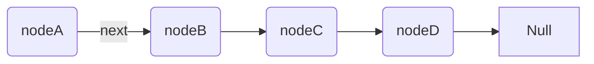
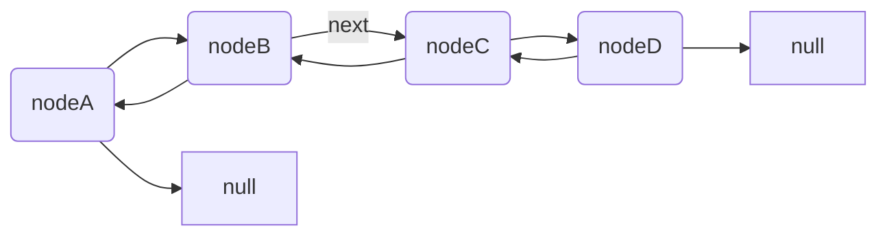

###### tags: `資料結構與演算法`
Linked List 類似 Array

```javascript=
function LinkedNode(val, next) {
  this.val = val || -1
  this.next = next || null
}

let list = new LinkedNode

let currentNode = list
while(current)

```
- 優點
  + 可以無限增加元素
  + 執行插入跟刪除時特別快
- 缺點
  + 需要更多的 memory
  + 一定要從頭開始讀，儲存方式是不連續的（記憶體位置分散）
  + 反向讀取的話會很麻煩

#### Doubly Linked List : 進階的 Linked List

有往回指的屬性
