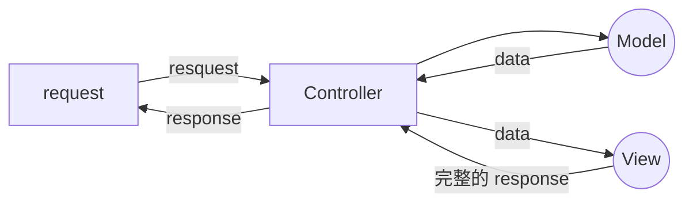

###### tags: `後端`

## 什麼是 MVC？

MVC（Model–view–controller）是一種軟體的設計模式（design pattern），將軟體系統分為三個基本部分：模型（Model）、視圖（View）和控制器（Controller）。

- Model
  負責資料，包含資料的存取、處理方法與邏輯模式
- View
  負責圖形介面的顯示
- Controller
  負責控制不同軟體的流程

MVC 架構的出現是為了解決早期網頁中處理資料的程式與負責顯示的 html 混雜在一起，造成後續維護不易的的狀況。

透過將 Model、View、Controller 分開，可以達成模組化的開發，例如多個 View 可以共用 Model，提升了程式碼的重用性。