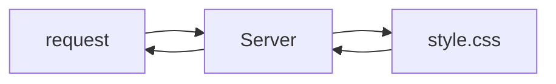
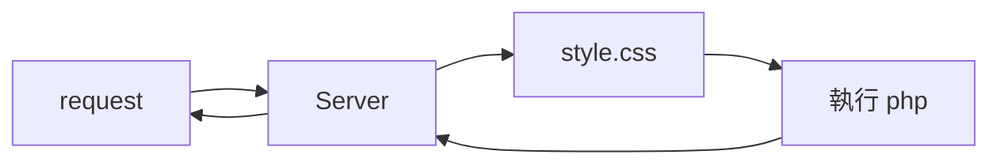

## 安裝 XAMPP
安裝 XAMPP 之後，執行 Apache 與 MySQL，點 Config，就能查到目錄。
檔案會在 `C:\xampp\htdocs` 中。

## 資料庫系統
server => 專門處理 request 跟 respone 的程式
資料庫系統 => 專門處理資料的程式

關聯式資料庫

關聯資料語言 SQL


NoSQL (Not only SQL)
例如MongoDB


CLI => mysql connect
GUI => 例如 phpMyAdmin

phpMyAdmin 

## table
### Schema 結構
每個表格都有 schema
phpMyAdmin 中可以從 schema / 結構中檢視
資料一定會有的是**名稱**與**型態**
* 名稱：就是名稱
* 型態：哪種儲存型態

CHAR：固定長度（0 ~ 255）的字串，不足時會自右邊補足空白
VARCHAR：可變長度（0 ~ 65,535）的字串，最大的有效長度需視資料列大小限制而定。

通常字數較少會存成 VARCHAR，例如文章標題。
字數較長會存成 TEXT，例如文章內文。

Primary Key (PK) 主鍵：不能為空，不能重複，最主要的，例如 id、會員帳號等
unique 唯一：資料不能重複（PK 一定是唯一）
index 索引：針對常查詢的欄位可以建立索引


## MySQL
### Select 查詢資料
```sql=
SELECT * FROM `qoo` --查詢所有，從 qoo 資料庫
SELECT * FROM qoo -- 可以加反引號也可以不加

SELECT id FROM qoo -- 搜尋欄
SELECT id, content FROM qoo -- 同時搜尋兩欄以 "," 進行分隔
SELECT id as name FROM qoo -- 查詢結果會 id 會以 name 顯示
SELECT * FROM qoo WHERE id = 2 -- 查詢 id 為 2 的資料
SELECT * FROM qoo where id = 1 and username = 'Peter' -- and 查詢條件
SELECT * FROM qoo where id = 1 or username = 'Peter' -- or 查詢條件
SELECT 10 FROM qoo -- 結果為 10
```

### Insert 新增資料
```sql=
INSERT INTO `qoo` (`username`, `content`) VALUES ("username01", "content01")
```

### Update 修改資料
```sql=
UPDATE `qoo` SET username = "user01", content = "content01" WHERE id = 1
```

### DELETE 刪除資料
```sql=
DELETE FROM `qoo` WHERE id = 2
```

## PHP
### Disable cache
開始前到開發人員工具的 Network，把 Disable cache 勾選起來。
目前用的工具會暫存快取，可能會造成瀏覽器讀取到舊的資料。

### PHP 執行流程 
#### 靜態檔案

#### 動態網站
Server 有設定 .php 檔案會執行

### PHP 語法
php 檔案中未用 `<?php ?>` 包住的程式碼會直接顯示
#### date 日期
```php=
<?php echo date("Y-m-d H:i:s") ?>
```

### 從前端傳資料給後端：GET 與 POST
可以在網址加上 query string，例如：
`http://localhost:8080/peter/vivian/data.php?a=1`
當加上 query string 時，php 會自動給一個變數 `$_GET`

> 假設網址是 ?a=&b=，只有傳 key 沒有傳 value，isset 的結果依舊會是 true
>必須連 key 都沒有傳，isset 才會是 false
>因此針對這種檢查，會推薦使用 empty 來檢測，因為 empty 可以順便檢測空字串的狀況

前端用表單，method 設為 `GET`，便能在網址中加上 query string。
>小技巧：開發工具勾選 Preserve log 可以查看發出的 request
#### 前後端溝通簡單範例（GET 表單）
index.php
```php=
<?php
  echo "Who are you?"
?>

<form method="GET" action="data.php">
  name: <input name="name" />
  age: <input name="age" />
  <input type="submit" />
</form>
```

data.php
```php=
<?php
  if (!isset($_GET['name']) || !isset($_GET['age'])) { //其中一項資料沒填的條件
    echo '資料有缺，請再次填寫<br>';
    exit();
  }
  
  echo "Hello!" . $_GET['name'] . "<br>";
  echo "Your age is" . $_GET['age'] . "<br>";
?>
```

#### 前後端溝通簡單範例（POST 表單）
index.php
```php=
<?php
  echo "Who are you?"
?>

<form method="POST" action="data.php">
  name: <input name="name" />
  age: <input name="age" />
  <input type="submit" />
</form>
```

data.php
```php=
<?php
  if (empty($_POST['name']) || empty($_POST['age'])) { 
    echo '資料有缺，請再次填寫<br>';
    exit();
  }
  
  echo "Hello!" . $_POST['name'] . "<br>";
  echo "Your age is" . $_POST['age'] . "<br>";
?>
```

### 從 PHP 連線到 MySQL 資料庫

進 phpMyAdmin，新增使用者帳號
全域權限可勾全選

建立資料表
編碼可用 utf8mb4_unicode_ci


```php=
<?php
  $server_name = 'localhost';
  $username = 'huli';
  $password = 'huli';
  $db_name = 'huli';

  $conn = new mysqli($server_name, $username, $password, $db_name);

  if ($conn->connect_error) { //物件存取屬性用 ->
    die('資料庫連線錯誤:' . $conn->connect_error); //die 執行完這行，接下來都不會執行
  }

  $conn->query('SET NAMES UTF8'); //設定編碼
  $conn->query('SET time_zone = "+8:00"'); //設定時區
?>
```
### PHP 與 MySQL 的互動
CRUD
Create
Read
Update
Delete

### PHP 與 MySQL 的互動：讀取資料

要連線可以加上在 `$conn` 用 `->` 加上 `query()`

connn.php 建議在 git 中設定 ignore，避免密碼等敏感資訊放到網路上。

每拿一筆資料需要 `$result->fetch_assoc()` 一次，可以用 while 迴圈來

```php=
<?php
require_once('conn.php');

  $result = $conn->query("SELECT * FROM users");
  if (!$result) {
    die($conn->error);
  }

  while ($row = $result->fetch_assoc()) { //把對應的資料取出
    echo "id:" . $row['id'] . '<br>';
    echo "username:" . $row['username'] . '<br>';
  }
?>
```

### PHP 與 MySQL 的互動：新增資料
`sprintf()` 字串組合，要帶進去的變數在文字中以 `%d` 表示數字、`%s`表示字串

`header("Location: index.php")` 回傳一個 response header，自動跳轉回 index.php
```php=
<?php
  require_once('conn.php');

  if (empty($_POST['username'])) {
    die('請輸入 username');
  }

  $username = $_POST['username'];
  $sql = sprintf(
    "insert into users(username) values('%s')",
    $username
  );
  $result = $conn->query($sql);
  if (!$result) {
    die($conn->error);
  }

  header("Location: index.php");
?>
```

### PHP 與 MySQL 的互動：刪除資料
顯示被影響的 row
```php=
<?php
  echo $conn->affected_rows;
?>
```


```php=
<?php
  require_once('conn.php');

  if (empty($_GET['id'])) {
    die('請輸入 id');
  }

  $id = $_GET['id'];
  $sql = sprintf(
    "delete from users where id = %d",
    $id
  );
  echo $sql . '<br>';
  $result = $conn->query($sql);
  if (!$result) {
    die($conn->error);
  }

  if ($conn->affected_rows >= 1) {
    echo '刪除成功';
  } else {
    echo '查無資料';
  }

  // header("Location: index.php");
?>
```

### PHP 與 MySQL 的互動：編輯資料


```php=
<?php
  require_once('conn.php');

  if (empty($_POST['id']) || empty($_POST['username'])) {
    die('請輸入 id 與 username');
  }

  $id = $_POST['id'];
  $username = $_POST['username'];
  $sql = sprintf(
    "update users set username='%s' where id=%d",
    $username,
    $id
  );
  echo $sql . '<br>';
  $result = $conn->query($sql);
  if (!$result) {
    die($conn->error);
  }

  header("Location: index.php");
?>
```

